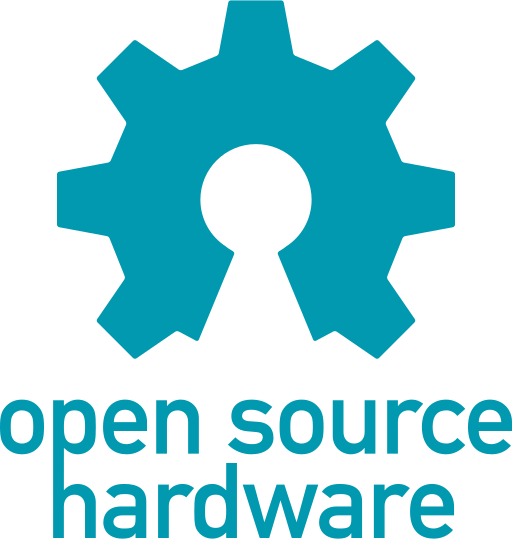

<!--
*** Thanks for checking out the Best-README-Template. If you have a suggestion
*** that would make this better, please fork the repo and create a pull request
*** or simply open an issue with the tag "enhancement".
*** Thanks again! Now go create something AMAZING! :D
***
***
***
*** To avoid retyping too much info. Do a search and replace for the following:
*** robert-inkpen, randeng_co_mirror, twitter_handle, email, project_title, project_description
-->


<!-- PROJECT SHIELDS -->
<!--
*** I'm using markdown "reference style" links for readability.
*** Reference links are enclosed in brackets [ ] instead of parentheses ( ).
*** See the bottom of this document for the declaration of the reference variables
*** for contributors-url, forks-url, etc. This is an optional, concise syntax you may use.
*** https://www.markdownguide.org/basic-syntax/#reference-style-links
-->

[![Contributors][contributors-shield]][contributors-url]
[![Forks][forks-shield]][forks-url]
[![Stargazers][stars-shield]][stars-url]
[![Issues][issues-shield]][issues-url]

<!-- PROJECT LOGO -->
<br />
<p align="center">
  <a href="https://github.com/robert-inkpen/randeng_co_mirror">
    
  </a>

  <h3 align="center">:alien: RandEng Co Smart Mirror/Screen for the masses :alien:</h3>

  <p align="center">
    I don't know why it has taken this long to reach out to my network of friends to collab on a project. We have so much brain power at our disposal and a massive 
    swath of abilities that cover every aspect you could ever need in product design. With data, electrical, software and aerospace engineers at our disposal we have the ability to design whatever we want. We all have had our own projects but its alot easier to stay motivated when its with a group so wether were making things just because we want them, because we maybe want to market them or just because we want to expand our abilities I think this could be a good, fun and not too serious way to kill some time in quarantine. As for this project I have had conversations with a bunch of people about the logistics of this and will do my best to add everything that was discussed so were all in the loop. 
    <br />
    <a href="https://github.com/robert-inkpen/randeng_co_mirror"><strong>Explore the docs »</strong></a>
    <br />
    <br />
    <a href="https://github.com/robert-inkpen/randeng_co_mirror">View Demo</a>
    ·
    <a href="https://github.com/robert-inkpen/randeng_co_mirror/issues">Report Bug</a>
    ·
    <a href="https://github.com/robert-inkpen/randeng_co_mirror/issues">Request Feature</a>
  </p>
</p>


<!-- TABLE OF CONTENTS -->
<details open="open">
  <summary><h2 style="display: inline-block">Table of Contents</h2></summary>
  <ol>
    <li>
      <a href="#about-the-project">About The Project</a>
      <ul>
        <li><a href="#built-with">Built With</a></li>
      </ul>
    </li>
    <li>
      <a href="#getting-started">Getting Started</a>
      <ul>
        <li><a href="#prerequisites">Prerequisites</a></li>
        <li><a href="#installation">Installation</a></li>
      </ul>
    </li>
    <li><a href="#usage">Usage</a></li>
    <li><a href="#roadmap">Roadmap</a></li>
    <li><a href="#contributing">Contributing</a></li>
    <li><a href="#license">License</a></li>
    <li><a href="#contact">Contact</a></li>
    <li><a href="#acknowledgements">Acknowledgements</a></li>
  </ol>
</details>


<!-- ABOUT THE PROJECT -->
## About The Project

<!-- [![Product Name Screen Shot][product-screenshot]](https://example.com) -->


### Built With

* []()
* []()
* []()


<!-- GETTING STARTED -->
## Getting Started

To get a local copy up and running follow these simple steps.

### Prerequisites


* Add here
  ```sh
  
  ```

### Installation

1. Clone the repo
   ```sh
   git clone https://github.com/robert-inkpen/randeng_co_mirror.git
   ```


<!-- USAGE EXAMPLES -->
## Usage

Demos go here

_For more examples, please refer to the [Documentation](https://example.com)_


<!-- ROADMAP -->
## Roadmap
Help out with adding stuff here 
See the [open issues](https://github.com/robert-inkpen/randeng_co_mirror/issues) for a list of proposed features (and known issues).


<!-- CONTRIBUTING -->
## Contributing


1. Fork the Project
2. Create your Feature Branch (`git checkout -b feature/AmazingFeature`)
3. Commit your Changes (`git commit -m 'Add some AmazingFeature'`)
4. Push to the Branch (`git push origin feature/AmazingFeature`)
5. Open a Pull Request


<!-- LICENSE -->
## License

Distributed under the MIT License. See `LICENSE` for more information.


<!-- CONTACT -->
## Contact

Rob Inkpen - robert.inkpen@ryerson.ca

Project Link: [https://github.com/robert-inkpen/randeng_co_mirror](https://github.com/robert-inkpen/randeng_co_mirror)


<!-- ACKNOWLEDGEMENTS
## Acknowledgements

* []()
* []()
* []() -->


<!-- MARKDOWN LINKS & IMAGES -->
<!-- https://www.markdownguide.org/basic-syntax/#reference-style-links -->
[contributors-shield]: https://img.shields.io/github/contributors/robert-inkpen/randeng_co_mirror.svg?style=for-the-badge
[contributors-url]: https://github.com/robert-inkpen/randeng_co_mirror/graphs/contributors
[forks-shield]: https://img.shields.io/github/forks/robert-inkpen/randeng_co_mirror.svg?style=for-the-badge
[forks-url]: https://github.com/robert-inkpen/randeng_co_mirror/network/members
[stars-shield]: https://img.shields.io/github/stars/robert-inkpen/randeng_co_mirror.svg?style=for-the-badge
[stars-url]: https://github.com/robert-inkpen/randeng_co_mirror/stargazers
[issues-shield]: https://img.shields.io/github/issues/robert-inkpen/randeng_co_mirror.svg?style=for-the-badge
[issues-url]: https://github.com/robert-inkpen/randeng_co_mirror/issues
